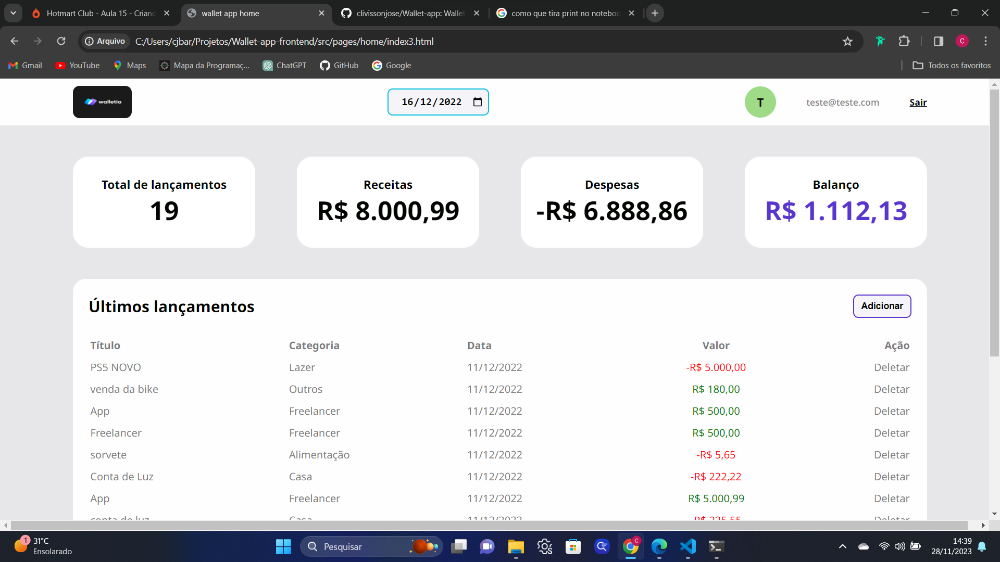

# Wallet App



## Introduction

This is an finences management dashboard mada with JavaScript, HTNL and CSS. The main goal is let the the user
add and delete his personal finances, and inform him the balance of the month

## Live Link
 https://clivissonjose.github.io/Wallet-app/

 ## Technologies used

 - JavaScript
 - HTML
 - CSS

 ## Instruction to run locally

 1. Clone the repo: 

 ```
 git clone https://github.com/clivissonjose/Wallet-app
 
 ```
 2. Navigate to the app folder: 
 ```
cd wallet-app-frontend
 ```
 3. Open the `index.html` file.

 4. Use the `teste@teste.com` or create your own perfil